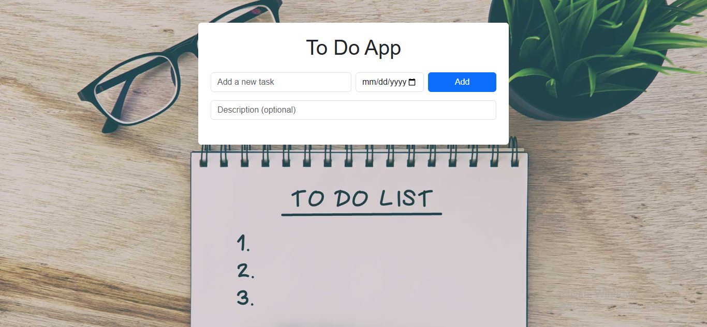

# To Do App

This is a simple and responsive To-Do List web application. It allows users to add tasks with an optional description and deadline. Tasks can be saved to and deleted from local storage, and the layout is styled using Bootstrap 5.

 

## Features

- Add new tasks with title, optional description, and optional deadline.
- Delete individual tasks.
- Persistent storage using `localStorage`.
- Responsive design using Bootstrap grid system.
- Enhanced user interface with background image and subtle shadows.

 

## File Structure

day15bonus/ 
├── README.md 
├── index.html 
├── images/ 
│&nbsp;&nbsp;&nbsp;&nbsp;└── back.jpg 
├── css/ 
│&nbsp;&nbsp;&nbsp;&nbsp;└── style.css 
│&nbsp;&nbsp;&nbsp;&nbsp;└── bootstrap.min.css 
└── js/ 
&nbsp;&nbsp;&nbsp;&nbsp;└── script.js 
&nbsp;&nbsp;&nbsp;&nbsp;└── bootstrap.bundle.min.js

 

## Technologies Used

- HTML5
- CSS3
- JavaScript (ES6+)
- Bootstrap 5
- localStorage

 

## How to Use

1. Open `index.html` in a browser.
2. Add a task title in the input field.
3. Optionally, add a description and a deadline.
4. Click **Add** to submit the task.
5. To remove a task, click the **Delete** button beside it.

 

## UI Preview

The app includes a background image (`back.jpg`) and Bootstrap styling for form elements and task items. Tasks appear as styled list items with a responsive layout.

 

## Notes

- Make sure the Bootstrap CSS and JS files are available in the `css/` and `js/` folders respectively.
- Customize the background image by replacing `images/back.jpg`.

